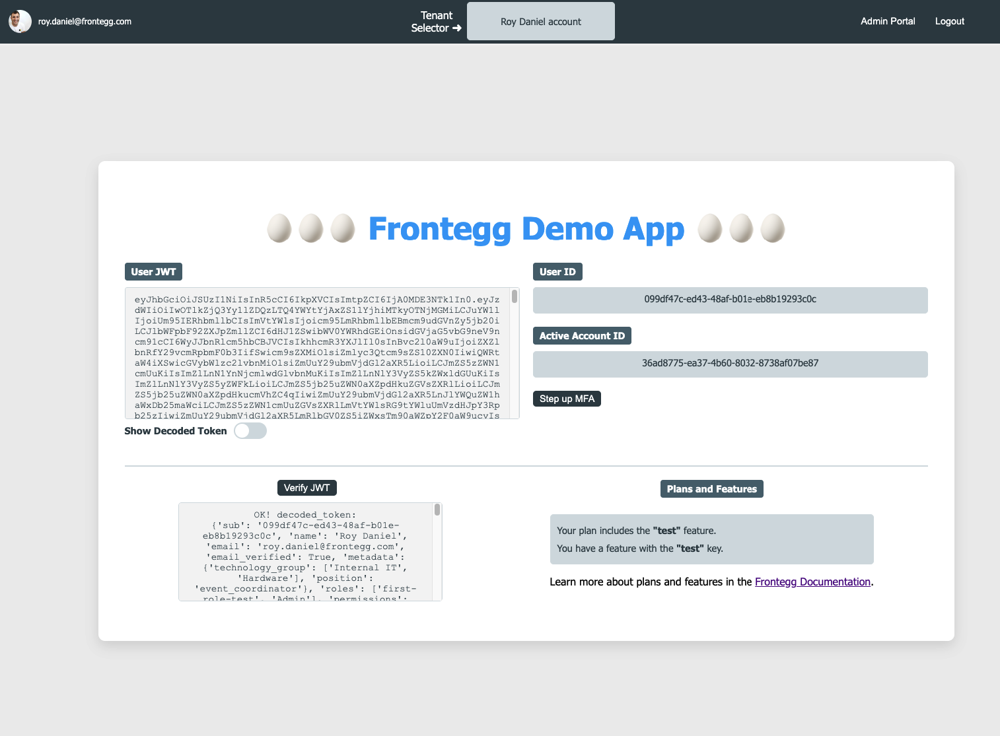

# Frontegg - Hosted Login React Integration

This project demonstrates how to integrate Frontegg's hosted login solution into a React application. It provides a seamless authentication experience with minimal setup.

## Table of Contents

- [Prerequisites](#prerequisites)
- [Frontegg Account Setup](#frontegg-account-setup)
- [Code Setup](#code-setup)
- [Environment Configuration](#environment-configuration)
- [Running the Application](#running-the-application)
- [Features](#features)
- [Components Overview](#components-overview)
- [Backend Server](#backend-server)

## Prerequisites

- Node.js and npm installed on your machine.

## Frontegg Account Setup

Sign up for a Frontegg account in one of our public regions:

- EU ➜ <a href="https://portal.frontegg.com/signup" target="_blank">https://portal.frontegg.com/signup</a>
- US ➜ <a href="https://portal.us.frontegg.com/signup" target="_blank">https://portal.us.frontegg.com/signup</a>
- CA ➜ <a href="https://portal.ca.frontegg.com/signup" target="_blank">https://portal.ca.frontegg.com/signup</a>
- AU ➜ <a href="https://portal.au.frontegg.com/signup" target="_blank">https://portal.au.frontegg.com/signup</a>

Complete the initial onboarding form and note down your Client ID and API Key from the Frontegg Portal.

## Code Setup

1. Clone the repository and install the dependencies:

   ```bash
   git clone https://github.com/fxcircus/frontegg-react-demo.git frontegg_sample
   cd frontegg_sample
   npm install
   ```

2. Open the project in your preferred IDE:

   ```bash
   code .
   ```

## Environment Configuration

1. Create a `.env` file in the root directory of the project.

2. Add your Frontegg credentials to the `.env` file:

   ```plaintext
   # Found in the Keys & Domains page
   REACT_APP_CLIENT_ID=[YOUR-CLIENT-ID]

   # Found in the Applications page under your application
   REACT_APP_BASE_URL=https://[YOUR_SUBDOMAIN].frontegg.com
   REACT_APP_APP_ID=[APPLICATION_ID]
   ```

3. Save the file.

## Running the Application

Start the development server:

```bash
npm start
```

Open your browser and navigate to `http://localhost:3000`. Sign up as a new user and explore the features Frontegg provides out of the box!



## Features

- **Hosted Login with Frontegg**

- **Account Switching and <a href="https://developers.frontegg.com/guides/authorization/entitlements/feature-based/plans" target="_blank">Entitlements</a>**: Easily switch between different accounts and manage user entitlements.
- **JWT Token Decoding**: View and decode the JWT token issued to users. Inspect the token's claims.
- **Copy Values with a Click**: Click on any value to copy it to your clipboard.
- **<a href="https://developers.frontegg.com/guides/admin-portal/intro" target="_blank">Admin Portal</a>**: Manage users, SSO connections, and other administrative tasks
- **<a href="https://developers.frontegg.com/guides/step-up/intro" target="_blank">Step-Up MFA</a>**: Enhance security by stepping up Multi-Factor Authentication (MFA) for sensitive operations. Learn more about.

## Components Overview

- **[App.js](src/App.js)**: The main application component.

- **[NavBar](src/components/Navbar.js)**: Displays user profile picture, email,  account selector, Admin portal and logout button.

- **[UserInfo.js](src/components/UserInfo.js)**: Shows detailed user information, including JWT tokens and user IDs. Allows users to copy values and toggle between encoded and decoded JWT views.

- **[AccountSwitcher.js](src/components/AccountSwitcher.js)**: Provides functionality to switch between different user accounts or tenants.

- **[EntitlementsInfo.js](src/components/EntitlementsInfo.js)**: Displays user \ account plans and features. 

- **[VerifyJWT.js](src/components/VerifyJWT.js)**: Verifies JWT tokens using a backend server.

## Backend Server

To verify JWT tokens, you can [clone this backend server example](https://github.com/fxcircus/frontegg-JWT-Verify). Follow the instructions in the ReadMe to set up and run the server locally.